# Scripture Racer — Multi-Mode Implementation Plan

> **Status:** Solo modes **implemented** (Phases 1–5). Live Room Race (Phase 6) **implemented** (Node HTTP+SSE server + lobby/peer bars/podium; Classic + Time Trial).  
> **Scope:** Three new solo game modes + **Live Room Race** (no accounts) on top of Classic  
> **Stack:** Vanilla JS client, Vite, localStorage; Live Race = `server/index.js` (REST + SSE)  
> **Constraint:** Keep the Ancient Scroll / parchment aesthetic; no user accounts; no heavy frameworks  
> **Live Race local run:** Terminal A `npm run race-server` · Terminal B `npm run dev` · Mode 🏁 Live Race

---

## Table of Contents

1. [Executive Summary](#1-executive-summary)
2. [Current Architecture Snapshot](#2-current-architecture-snapshot)
3. [Shared Foundation (Build First)](#3-shared-foundation-build-first)
4. [Mode A — Classic (Existing)](#4-mode-a--classic-existing)
5. [Mode B — Time Trial (Verse Storm)](#5-mode-b--time-trial-verse-storm)
6. [Mode C — Ghost Race (Beat Your Shadow)](#6-mode-c--ghost-race-beat-your-shadow)
7. [Mode D — Manna Rain (Falling Words)](#7-mode-d--manna-rain-falling-words)
8. [Mode E — Live Room Race (Contest)](#8-mode-e--live-room-race-contest)
9. [Cross-Cutting Systems](#9-cross-cutting-systems)
10. [File & Module Structure](#10-file--module-structure)
11. [UI / UX Spec](#11-ui--ux-spec)
12. [Data Model & Persistence](#12-data-model--persistence)
13. [Phased Delivery Roadmap](#13-phased-delivery-roadmap)
14. [Testing Checklist](#14-testing-checklist)
15. [Risks & Mitigations](#15-risks--mitigations)
16. [Approval Checklist](#16-approval-checklist)
17. [Open Decisions for You](#17-open-decisions-for-you)

---

## 1. Executive Summary

Scripture Racer currently has **one game loop**: load a verse → type it character-by-character → show WPM / accuracy / time. That loop is solid. This plan adds **three solo modes** plus **Live Room Race** (multiplayer contest, **no accounts**) without rewriting the soul of the app.

| ID | Mode | Player fantasy | Novelty | Effort | Priority |
|----|------|----------------|---------|--------|----------|
| **A** | Classic | Type the full verse | Baseline | — | Keep |
| **B** | Time Trial | Race the clock across many verses | Medium | **S** | Phase 2 |
| **C** | Ghost Race | Beat your own best pace | Medium | **M** | Phase 3 |
| **D** | Manna Rain | Type falling Bible words before they hit the ground | **High** | **L** | Phase 4 |
| **E** | Live Room Race | Race friends in a shared room (code join, no login) | **High** | **XL** | Phase 6 |

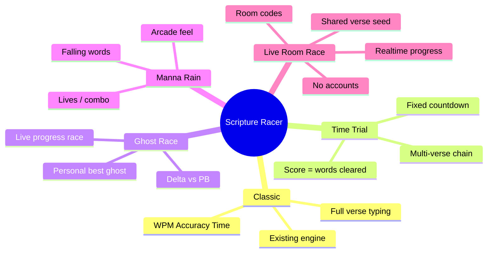
```mermaid
mindmap
  root((Scripture Racer))
    Classic
      Full verse typing
      WPM Accuracy Time
      Existing engine
    Time Trial
      Fixed countdown
      Multi-verse chain
      Score = words cleared
    Ghost Race
      Personal best ghost
      Live progress race
      Delta vs PB
    Manna Rain
      Falling words
      Lives / combo
      Arcade feel
    Live Room Race
      Room codes
      No accounts
      Realtime progress
      Shared verse seed
```

**Recommended ship order:** Shared foundation → Time Trial → Ghost Race → Manna Rain → polish → **Live Room Race**.  
Solo modes ship first and stay fully playable offline. Live Race is a later layer that **reuses** Classic / Time Trial race loops over a shared room protocol.

---

## 2. Current Architecture Snapshot

### 2.1 What already works

| System | Location | Reuse for modes |
|--------|----------|-----------------|
| Verse bank + difficulty filter | `app.js` `BIBLE_VERSES`, `getFilteredVerse()` | All modes |
| Bible API + custom paste | `fetchRandomVerse()`, custom handlers | All modes |
| Char-level typing engine | `typingInputEl` `input` listener | Classic, Time Trial, Ghost |
| Live stats (WPM / Acc / Timer) | `updateLiveStats()`, `tick()` | All (adapted) |
| Completion modal | `#modalOverlay` | All (mode-specific fields) |
| Leaderboard + history | `tr_leaderboard`, `tr_history` | Extend with `mode` key |
| Themes, sound, streak, PWA | existing | Global, mode-agnostic |

### 2.2 Current single-mode flow

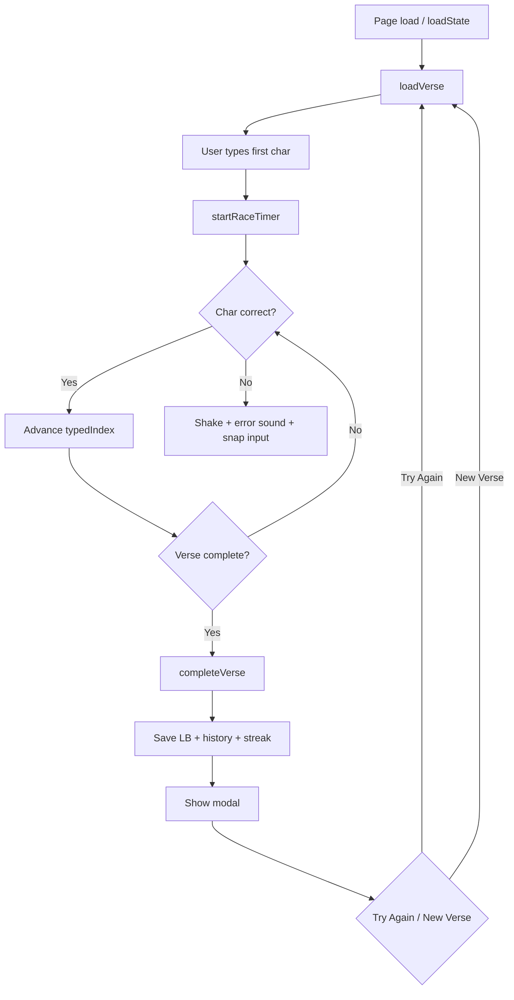
```mermaid
flowchart TD
    A[Page load / loadState] --> B[loadVerse]
    B --> C[User types first char]
    C --> D[startRaceTimer]
    D --> E{Char correct?}
    E -->|Yes| F[Advance typedIndex]
    E -->|No| G[Shake + error sound + snap input]
    F --> H{Verse complete?}
    H -->|No| E
    H -->|Yes| I[completeVerse]
    I --> J[Save LB + history + streak]
    J --> K[Show modal]
    K --> L{Try Again / New Verse}
    L -->|Try Again| B
    L -->|New Verse| B
```

### 2.3 Pain points to fix while multi-moding

1. **Monolithic `app.js`** — mode logic will bloat further if not split.
2. **Leaderboard is difficulty-only** — no `mode` dimension yet.
3. **Hard-wired stats bar** — Timer meaning differs per mode (count-up vs countdown vs lives).
4. **Completion modal** always shows WPM/Accuracy/Time — Manna Rain needs Score/Combo/Lives.

---

## 3. Shared Foundation (Build First)

Everything below is **Phase 1** and is required before any new mode UI.

### 3.1 Goals

- Introduce a first-class **game mode** concept.
- Route start / tick / input / complete through a **mode controller**.
- Extend persistence so scores never mix across modes.
- Add a **Mode Selector** in the header UI without breaking Classic.

### 3.2 Mode registry

```js
// Conceptual — final shape may vary slightly
const MODES = {
  classic:    { id: "classic",    label: "Classic",     icon: "📜" },
  timeTrial:  { id: "timeTrial",  label: "Time Trial",  icon: "⏱️" },
  ghost:      { id: "ghost",      label: "Ghost Race",  icon: "👻" },
  mannaRain:  { id: "mannaRain",  label: "Manna Rain",  icon: "🌧️" },
  liveRace:   { id: "liveRace",   label: "Live Race",   icon: "🏁" }, // multiplayer shell
};

let currentMode = "classic"; // persisted as tr_mode
```

### 3.3 Mode controller interface

Each mode implements the same lifecycle so switching is clean:

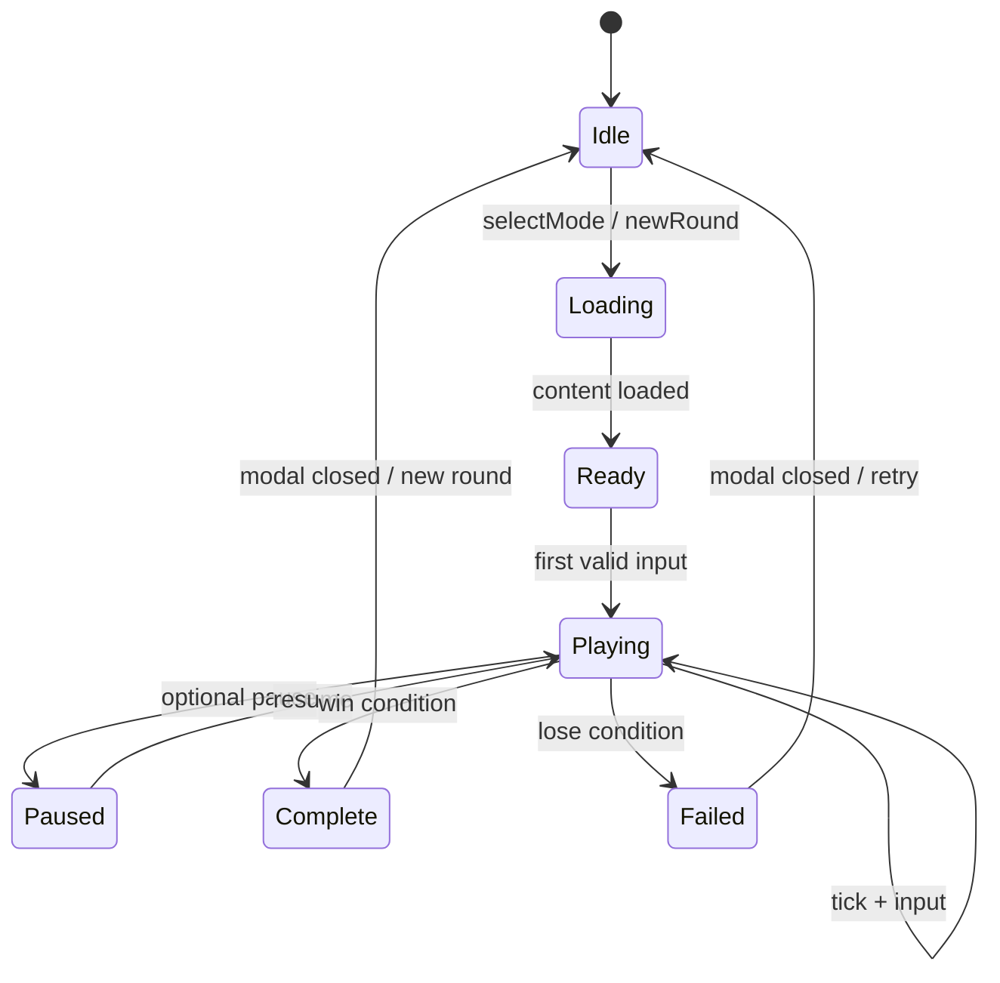
```mermaid
stateDiagram-v2
    [*] --> Idle
    Idle --> Loading: selectMode / newRound
    Loading --> Ready: content loaded
    Ready --> Playing: first valid input
    Playing --> Playing: tick + input
    Playing --> Paused: optional pause
    Paused --> Playing: resume
    Playing --> Complete: win condition
    Playing --> Failed: lose condition
    Complete --> Idle: modal closed / new round
    Failed --> Idle: modal closed / retry
```

**Required hooks per mode:**

| Hook | Responsibility |
|------|----------------|
| `enter()` | Show mode-specific UI, reset state, hide irrelevant controls |
| `exit()` | Tear down RAF loops, DOM nodes, listeners unique to mode |
| `startRound(verse?)` | Prepare content (verse / word queue) |
| `onInput(e)` | Handle typing (or delegate to shared char engine) |
| `onTick(now)` | Update timers, physics, ghost position |
| `getLiveStats()` | Return `{ primary, secondary, tertiary }` for stats bar |
| `complete(result)` | Normalize result → modal + persistence |
| `getResultSchema()` | Fields shown on completion modal |

### 3.4 Shared services (extract, don’t rewrite)

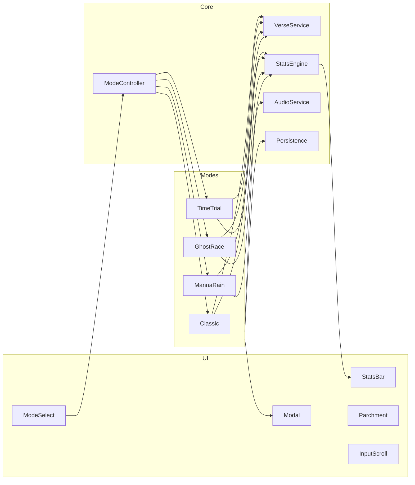
```mermaid
flowchart LR
    subgraph UI
        ModeSelect
        StatsBar
        Parchment
        InputScroll
        Modal
    end

    subgraph Core
        ModeController
        VerseService
        StatsEngine
        AudioService
        Persistence
    end

    subgraph Modes
        Classic
        TimeTrial
        GhostRace
        MannaRain
    end

    ModeSelect --> ModeController
    ModeController --> Classic
    ModeController --> TimeTrial
    ModeController --> GhostRace
    ModeController --> MannaRain
    Classic --> VerseService
    TimeTrial --> VerseService
    GhostRace --> VerseService
    MannaRain --> VerseService
    Classic --> StatsEngine
    TimeTrial --> StatsEngine
    GhostRace --> StatsEngine
    MannaRain --> StatsEngine
    Modes --> AudioService
    Modes --> Persistence
    StatsEngine --> StatsBar
    Modes --> Modal
```

| Service | Responsibility |
|---------|----------------|
| `VerseService` | Filter bank, API fetch, custom verse, split into chars/words |
| `StatsEngine` | WPM formula, accuracy, elapsed time helpers |
| `AudioService` | Existing key / error / bell / stamp (already present) |
| `Persistence` | Mode-aware leaderboard + history + settings |
| `ModeController` | Switch modes safely, own `currentMode` |

### 3.5 UI shell changes (shared)

**Mode selector** — place near difficulty seals (or under title):

```
[ 📜 Classic ] [ ⏱️ Time Trial ] [ 👻 Ghost ] [ 🌧️ Manna Rain ]
```

- Radio-style buttons matching existing `.seal-button` language.
- Changing mode: confirm if mid-run (`isPlaying`), else switch immediately.
- Persist last mode via `localStorage.tr_mode`.

**Stats bar becomes slot-based:**

| Slot | Classic | Time Trial | Ghost Race | Manna Rain |
|------|---------|------------|------------|------------|
| Left | WPM | Score | WPM | Score |
| Mid | Accuracy | Accuracy | Accuracy | Combo |
| Right | Timer ↑ | Countdown ↓ | Ghost Δ | Lives |

### 3.6 Acceptance criteria — Foundation

- [ ] Mode can be switched with zero console errors
- [ ] Classic still behaves identically to today
- [ ] `tr_mode` persists across reload
- [ ] Leaderboard/history entries store `mode`
- [ ] Mid-run mode switch either blocked or soft-resets cleanly

---

## 4. Mode A — Classic (Existing)

**No feature change required.** Refactor only: wrap current flow as the `classic` mode implementation so other modes can plug in beside it.

### 4.1 Win / lose

- **Win:** type every character of the verse correctly (current behavior).
- **Lose:** none (errors allowed; accuracy drops).

### 4.2 Metrics

- Final WPM, Accuracy %, Time taken (unchanged).

### 4.3 Work items

1. Extract current input handler into `modes/classic.js` (or section).
2. Keep public API compatible with `ModeController`.
3. Regression-test full TESTING_PLAN Classic paths.

---

## 5. Mode B — Time Trial (Verse Storm)

### 5.1 Player fantasy

> “How much of the Word can I type before the hourglass runs out?”

Short, intense, highly replayable. Best first new mode because it reuses ~90% of the Classic engine.

### 5.2 Rules

| Rule | Detail |
|------|--------|
| Duration | Selectable: **30s / 60s / 90s** (default **60s**) |
| Content | Chain random verses filtered by difficulty + translation |
| Scoring | **+1 word** when a word boundary is completed correctly; or **+chars/5** as fallback — **prefer word count** |
| Incomplete verse at buzzer | Partial words **do not** count; final score freezes |
| Errors | Allowed; reduce accuracy; do **not** end the run |
| Streak | +1 per fully completed verse during the trial |
| End | Countdown hits `0` → `complete(result)` |

### 5.3 Flow

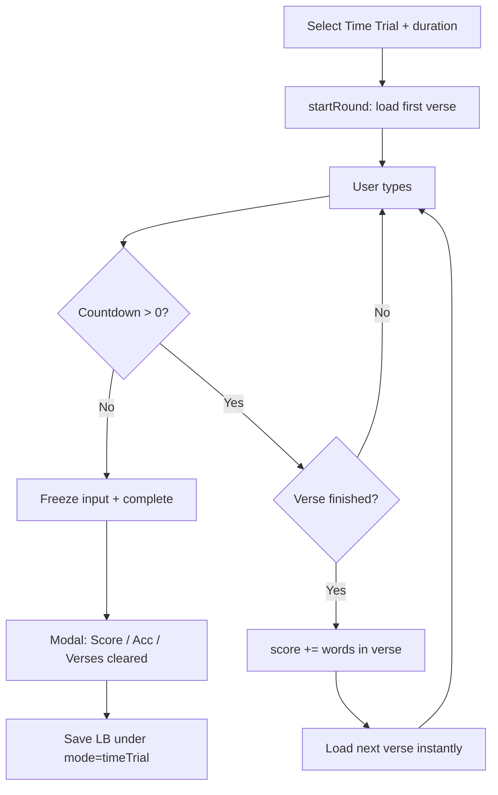
```mermaid
flowchart TD
    A[Select Time Trial + duration] --> B[startRound: load first verse]
    B --> C[User types]
    C --> D{Countdown > 0?}
    D -->|No| E[Freeze input + complete]
    D -->|Yes| F{Verse finished?}
    F -->|No| C
    F -->|Yes| G[score += words in verse]
    G --> H[Load next verse instantly]
    H --> C
    E --> I[Modal: Score / Acc / Verses cleared]
    I --> J[Save LB under mode=timeTrial]
```

### 5.4 Timing model

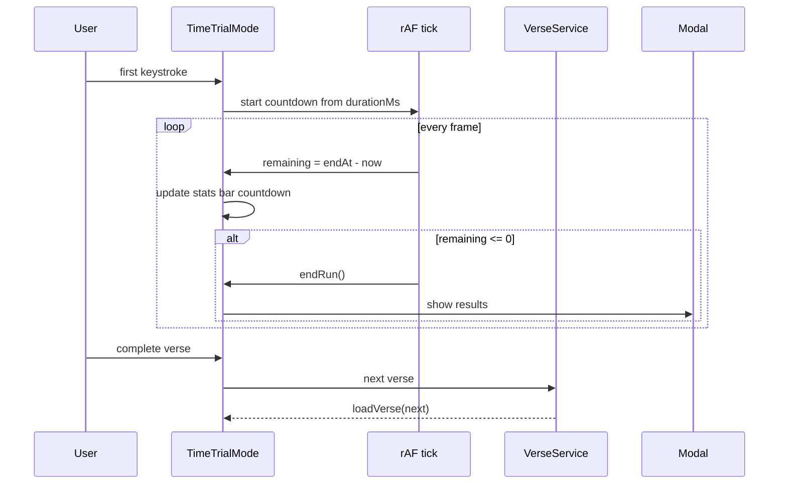
```mermaid
sequenceDiagram
    participant U as User
    participant TT as TimeTrialMode
    participant T as rAF tick
    participant V as VerseService
    participant M as Modal

    U->>TT: first keystroke
    TT->>T: start countdown from durationMs
    loop every frame
        T->>TT: remaining = endAt - now
        TT->>TT: update stats bar countdown
        alt remaining <= 0
            T->>TT: endRun()
            TT->>M: show results
        end
    end
    U->>TT: complete verse
    TT->>V: next verse
    V-->>TT: loadVerse(next)
```

**Implementation notes:**

- Use **deadline timestamp** (`endAt = startTime + durationMs`), not decrementing a counter each second (avoids drift; same pattern as current rAF timer).
- On verse complete mid-trial: **do not** open the Classic completion modal — flash a small “+1 verse” toast, load next verse, keep timer running.
- Only the **final** modal opens when time expires.

### 5.5 Scoring formula

```
wordsCleared  = total fully typed words across all verses
versesCleared = number of complete verses
accuracy      = (totalKeystrokes - errors) / totalKeystrokes
finalScore    = wordsCleared   // primary leaderboard sort key
// optional tie-break: higher accuracy, then more verses
```

### 5.6 UI specifics

| Element | Behavior |
|---------|----------|
| Duration chips | `30` `60` `90` near mode panel (only visible in Time Trial) |
| Stats right slot | `0:45` countdown, turns red under 10s |
| Parchment | Same as Classic |
| Mid-run toast | Subtle “Verse cleared · 3” near streak badge |
| Modal title | “Time’s Up” / “Trial Complete” |
| Modal stats | Score (words) · Accuracy · Verses · Peak WPM |

### 5.7 Persistence

```js
// Leaderboard entry
{
  mode: "timeTrial",
  difficulty: "MEDIUM",
  score: 84,          // words
  accuracy: 96,
  duration: 60,
  verses: 4,
  date: "...",
  ref: "multi"        // or last verse ref
}
```

Sort by `score` desc, then `accuracy` desc.

### 5.8 Acceptance criteria — Time Trial

- [ ] Countdown is accurate within ~50ms of wall clock
- [ ] Multiple verses chain without modal interruption
- [ ] Score only counts complete words
- [ ] Input locks at 0:00
- [ ] Scores appear under Time Trial leaderboard tab/filter
- [ ] Classic scores unaffected

### 5.9 Effort estimate

**~4–6 hours** after foundation.

---

## 6. Mode C — Ghost Race (Beat Your Shadow)

### 6.1 Player fantasy

> “Race the you who typed this best before.”

Self-competition using data the app already collects. Same typing surface as Classic; new **ghost layer**.

### 6.2 Rules

| Rule | Detail |
|------|--------|
| Ghost source | Best recorded run for **same difficulty** (and optionally same verse ref if available) |
| Ghost metric | Progress 0→100% over the **duration of the PB run** |
| Win | Finish verse with time **strictly less** than ghost duration |
| Tie | Count as win if equal or faster (document choice: **≤ ghost time = win**) |
| No ghost yet | First run records a ghost; UI shows “Set your first shadow” — no race |
| Errors | Same as Classic |

### 6.3 Ghost data model

```js
// tr_ghosts
{
  "MEDIUM": {
    // global best for difficulty (v1 — simple)
    durationMs: 18200,
    charCount: 142,
    wpm: 78,
    accuracy: 97,
    ref: "John 3:16",
    textHash: "abc123",   // optional: only replay on same text
    recordedAt: 1710000000000
  }
}
```

**v1 recommendation:** ghost is **best WPM run per difficulty**, replayed as linear progress over its duration (not a full keystroke log). Simpler, still feels great.

**v2 (optional later):** store sparse progress samples `[tMs, charIndex][]` for non-linear ghost (pauses, bursts).

### 6.4 Flow

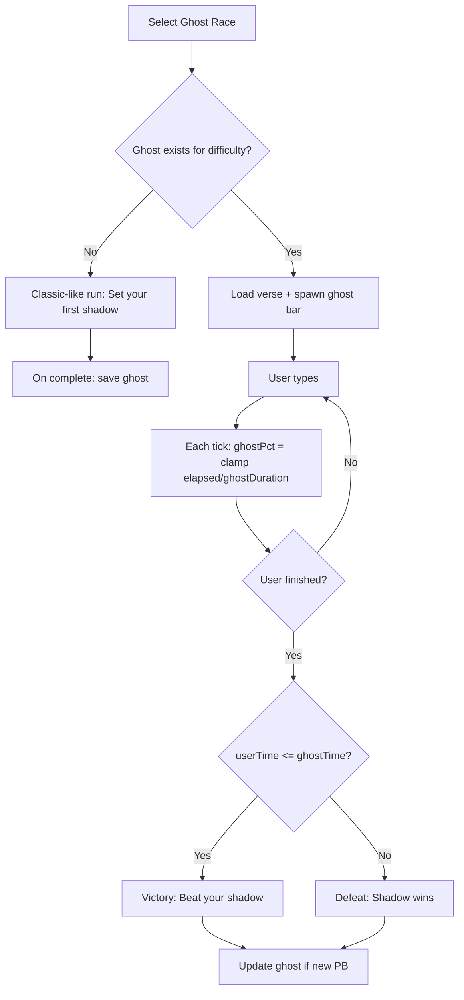
```mermaid
flowchart TD
    A[Select Ghost Race] --> B{Ghost exists for difficulty?}
    B -->|No| C[Classic-like run: Set your first shadow]
    C --> D[On complete: save ghost]
    B -->|Yes| E[Load verse + spawn ghost bar]
    E --> F[User types]
    F --> G[Each tick: ghostPct = clamp elapsed/ghostDuration]
    G --> H{User finished?}
    H -->|No| F
    H -->|Yes| I{userTime <= ghostTime?}
    I -->|Yes| J[Victory: Beat your shadow]
    I -->|No| K[Defeat: Shadow wins]
    J --> L[Update ghost if new PB]
    K --> L
```

### 6.5 Visual design

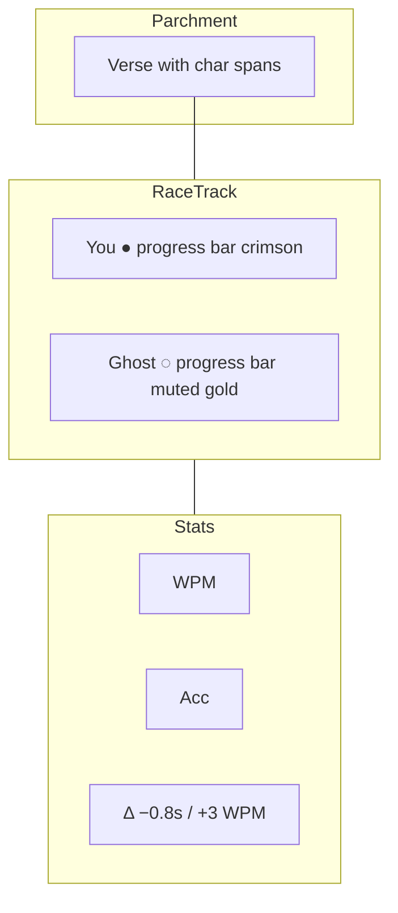
```mermaid
flowchart TB
    subgraph Parchment
        VerseText[Verse with char spans]
    end
    subgraph RaceTrack
        You[You ● progress bar crimson]
        Ghost[Ghost ◌ progress bar muted gold]
    end
    subgraph Stats
        WPM
        Acc
        Delta["Δ −0.8s / +3 WPM"]
    end
    VerseText --- RaceTrack
    RaceTrack --- Stats
```

| Element | Spec |
|---------|------|
| Dual progress bars | Above or below parchment; height ~6–8px; parchment-friendly colors |
| Ghost cursor optional | Faint underline advancing on verse text (nice-to-have) |
| Live delta | `−1.2s` green when ahead, `+0.9s` red when behind |
| Modal | “Shadow Defeated” / “Shadow Prevails” + WPM + time + Δ |

### 6.6 Update policy for ghost

```
on complete:
  if no ghost OR newWpm > ghost.wpm OR (newWpm == ghost.wpm AND newTime < ghost.time):
    save as new ghost
```

### 6.7 Acceptance criteria — Ghost Race

- [ ] First run creates a ghost without racing
- [ ] Subsequent runs show moving ghost progress
- [ ] Ghost finishes at approximately recorded PB duration
- [ ] Win/lose modal copy is correct
- [ ] Changing difficulty loads that difficulty’s ghost
- [ ] Deleting localStorage resets ghosts cleanly

### 6.8 Effort estimate

**~6–8 hours** after foundation (UI polish is the bulk).

---

## 7. Mode D — Manna Rain (Falling Words)

### 7.1 Player fantasy

> “Words fall from heaven. Type them before they touch the earth.”

This is the **flagship arcade mode** — the most visually distinct and the idea that best differentiates Scripture Racer from “just another typer.”

### 7.2 Rules (v1)

| Rule | Detail |
|------|--------|
| Source | Current verse split into words (punctuation attached to word or stripped — **decision:** strip trailing punctuation for match, show clean word) |
| Spawn | Words enter from top of playfield at intervals |
| Fall | Constant vertical speed; optional slight horizontal drift |
| Match | Player types word + Space/Enter to submit (or auto-commit on exact match) |
| Clear | Correct match removes that word, +score, +combo |
| Miss | Word reaches bottom → −1 life, combo reset |
| Lives | **3** (Easy: 5, Medium: 3, Hard: 2 — optional) |
| Win | Clear **all words** from the verse queue |
| Lose | Lives hit 0 |
| Multi-word on screen | Target resolution required (see §7.5) |

### 7.3 Difficulty parameters

| Param | Easy | Medium | Hard |
|-------|------|--------|------|
| Fall speed (px/s) | 40 | 70 | 110 |
| Max simultaneous words | 2 | 3 | 5 |
| Spawn interval (ms) | 1600 | 1100 | 700 |
| Lives | 5 | 3 | 2 |
| Min word length filter | none | none | none (all verse words) |

Speeds tuned during playtest; treat table as starting point.

### 7.4 Architecture

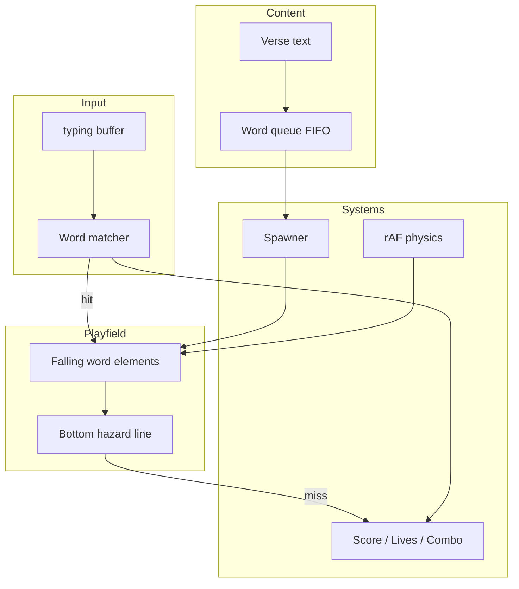
```mermaid
flowchart TB
    subgraph Content
        Verse[Verse text]
        Queue[Word queue FIFO]
    end

    subgraph Playfield
        DOM[Falling word elements]
        Ground[Bottom hazard line]
    end

    subgraph Input
        Buffer[typing buffer]
        Matcher[Word matcher]
    end

    subgraph Systems
        Spawner[Spawner]
        Physics[rAF physics]
        Combat[Score / Lives / Combo]
    end

    Verse --> Queue
    Queue --> Spawner
    Spawner --> DOM
    Physics --> DOM
    DOM --> Ground
    Ground -->|miss| Combat
    Buffer --> Matcher
    Matcher -->|hit| DOM
    Matcher --> Combat
```

### 7.5 Word targeting rules (critical UX)

When multiple words are on screen, matching must feel fair:

**Recommended v1 algorithm — Prefix lock:**

1. As the user types, find all active words whose remaining text **starts with** the buffer (case-sensitive to match Classic).
2. If exactly one match → **lock** that word (highlight it).
3. If multiple matches → lock the **lowest** word (most urgent / closest to ground).
4. On full match → destroy locked word, clear buffer, +score.
5. On mismatch that invalidates lock → flash error, clear buffer (or backspace allowed).

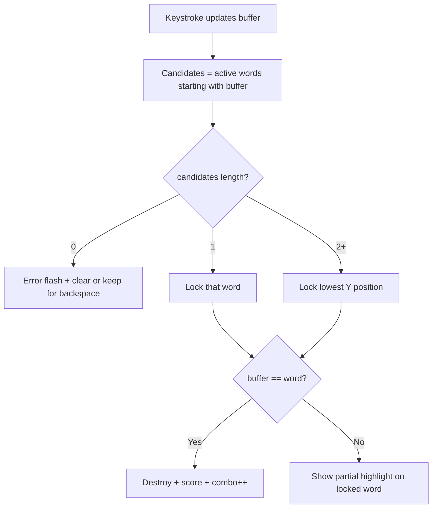
```mermaid
flowchart TD
    A[Keystroke updates buffer] --> B[Candidates = active words starting with buffer]
    B --> C{candidates length?}
    C -->|0| D[Error flash + clear or keep for backspace]
    C -->|1| E[Lock that word]
    C -->|2+| F[Lock lowest Y position]
    E --> G{buffer == word?}
    F --> G
    G -->|Yes| H[Destroy + score + combo++]
    G -->|No| I[Show partial highlight on locked word]
```

### 7.6 Scoring

```
base      = word.length
comboMult = 1 + floor(combo / 5) * 0.25   // every 5 streak
points    = round(base * comboMult * speedBonus)
// speedBonus optional: faster clear of a near-ground word → small bonus
```

Leaderboard sort key: **score**, tie-break accuracy or max combo.

### 7.7 Rendering approach

**Prefer DOM + CSS transforms** (not Canvas) for v1:

- Why: matches existing span-based styling, easier theme integration, simpler hit highlighting.
- Playfield: `#mannaPlayfield` inside or replacing parchment body during this mode.
- Each word: `<div class="falling-word" style="transform: translate(x,y)">`.
- Physics: rAF updates `y += speed * dt`; remove when `y > groundY`.

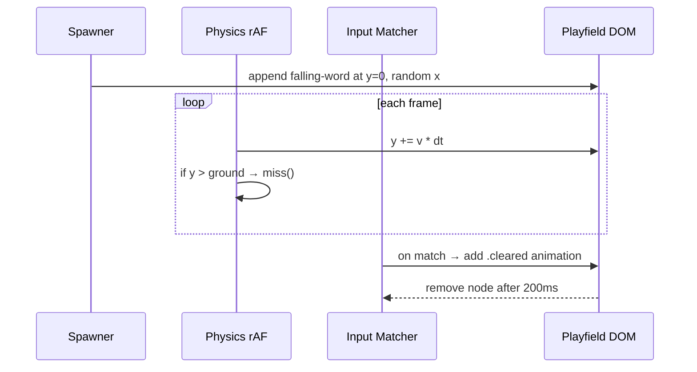
```mermaid
sequenceDiagram
    participant S as Spawner
    participant P as Physics rAF
    participant I as Input Matcher
    participant UI as Playfield DOM

    S->>UI: append falling-word at y=0, random x
    loop each frame
        P->>UI: y += v * dt
        P->>P: if y > ground → miss()
    end
    I->>UI: on match → add .cleared animation
    UI-->>I: remove node after 200ms
```

### 7.8 UI layout

```
┌─────────────────────────────────────┐
│  Lives ❤❤❤     Combo x4     Score  │
│─────────────────────────────────────│
│                                     │
│         grace                       │  ← falling
│              upon                   │
│    you                              │
│─────────────────────────────────────│  ← ground line (wax seal red)
│  [ type here .............. ]       │
└─────────────────────────────────────┘
```

- Hide Classic verse full-text display **or** show dim “source reference only” during rain.
- Optional: small “words left in verse” counter.

### 7.9 Thematic polish (fits existing brand)

| Beat | Feedback |
|------|----------|
| Word spawn | Soft fade-in |
| Correct clear | Stamp sound + gold flash + particles (CSS) |
| Miss | Parchment shake + error sound + life −1 |
| Combo ≥ 5 | Streak-style fire badge “🔥 x5” |
| Win | Bell + modal “The Word gathered” |
| Lose | Modal “Fell on rocky ground” + blessing still shown |

### 7.10 Mobile considerations

| Issue | Mitigation |
|-------|------------|
| Software keyboard covers playfield | Shrink playfield height when input focused; or warn “Best on keyboard” |
| Slow typing vs fall speed | Easy defaults slower; detect touch and auto-select Easy params |
| Accidental blur | Keep focus trap on input during run |

### 7.11 Acceptance criteria — Manna Rain

- [ ] Words fall smoothly (no jank on mid-range laptops)
- [ ] Prefix-lock targeting never destroys the wrong word unfairly
- [ ] Lives decrement only on ground hit
- [ ] Clearing full verse queue wins even with lives remaining
- [ ] 0 lives ends run immediately
- [ ] Score + max combo saved under `mode: mannaRain`
- [ ] Mode exit cleans all falling nodes and cancels rAF

### 7.12 Effort estimate

**~12–16 hours** after foundation (physics + targeting + polish).

---

## 8. Mode E — Live Room Race (Contest)

### 8.1 Player fantasy

> “Create a room, share a code, race the same Scripture together — no signup.”

**Contest = live room race.** Friends join with a short code, host starts, everyone types the **same verse (or Time Trial seed)** at the same time, and a live progress board shows who is ahead. When the race ends, a shared podium appears. Rooms are ephemeral. **No accounts, no email, no passwords.**

### 8.2 Product defaults (locked for v1)

| Decision | Default |
|----------|---------|
| Auth | **None** — display name + ephemeral `playerId` only |
| Join method | **4–6 character room code** (e.g. `AB7K`) + optional copyable invite link `?room=AB7K` |
| Max players | **8** per room |
| Min players to start | **2** (host may solo-test with 1 in dev only; production requires 2+) |
| Who starts | **Host only** |
| Race modes in v1 | **Classic** and **Time Trial** only |
| Out of scope v1 | Manna Rain multiplayer, Ghost multiplayer, ranked matchmaking, persistent global ladder |
| Identity | Auto `Pilgrim-####` or user-typed display name (max 16 chars, filtered) |
| Room lifetime | **45 minutes** idle / **10 minutes** after race ends → server purges |
| Spectator | Not in v1 |
| Rematch | Host can **Play again** with same roster + new verse seed |

### 8.3 Why this comes last


```mermaid
flowchart LR
    Solo[Solo modes stable] --> Shared[Shared race loop]
    Shared --> Net[Room protocol]
    Net --> Live[Live Room Race]
```

Live Race is not a fourth typing *mechanic* — it is a **multiplayer shell** around existing solo engines. Building it before Classic/Time Trial are solid would mean debugging network *and* gameplay at once.

### 8.4 High-level architecture

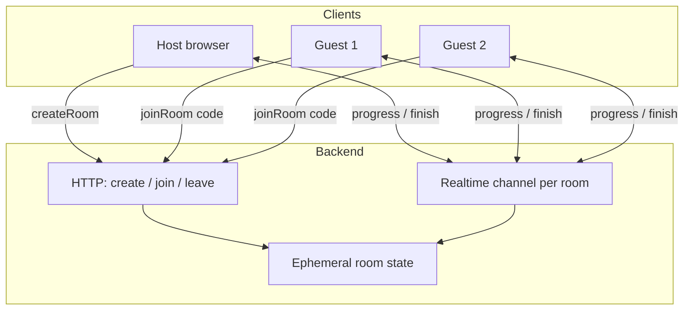
```mermaid
flowchart TB
    subgraph Clients
        H[Host browser]
        G1[Guest 1]
        G2[Guest 2]
    end

    subgraph Backend
        API[HTTP: create / join / leave]
        RT[Realtime channel per room]
        Store[Ephemeral room state]
    end

    H -->|createRoom| API
    G1 -->|joinRoom code| API
    G2 -->|joinRoom code| API
    API --> Store
    H <-->|progress / finish| RT
    G1 <-->|progress / finish| RT
    G2 <-->|progress / finish| RT
    RT --> Store
```

**Client stays vanilla JS.** Backend is the only new stack piece.

**Recommended backend (default):** Cloudflare Workers + Durable Objects (or equivalent: Supabase Realtime, PartyKit, Firebase RTDB). Pick one host that supports:

- Short-lived room state
- WebSocket or SSE fan-out
- Low cost at hobby scale
- Deployable next to / alongside the existing Vercel static app

Frontend talks to `RACE_SERVER_URL` via env (Vite `import.meta.env.VITE_RACE_URL`).

### 8.5 Room lifecycle

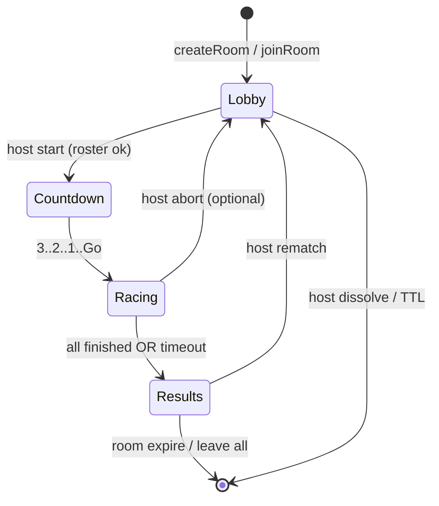
```mermaid
stateDiagram-v2
    [*] --> Lobby: createRoom / joinRoom
    Lobby --> Countdown: host start (roster ok)
    Countdown --> Racing: 3..2..1..Go
    Racing --> Results: all finished OR timeout
    Results --> Lobby: host rematch
    Results --> [*]: room expire / leave all
    Lobby --> [*]: host dissolve / TTL
    Racing --> Lobby: host abort (optional)
```

| Phase | What players see |
|-------|------------------|
| **Lobby** | Code, roster list, mode/difficulty (host-controlled), Ready toggle, Start (host) |
| **Countdown** | Locked settings, shared verse prefetched, 3–2–1 overlay |
| **Racing** | Same typing UI as solo mode + **peer progress rail** |
| **Results** | Ranked podium (place, name, WPM/score, accuracy, time) |

### 8.6 Sequence — create, join, race

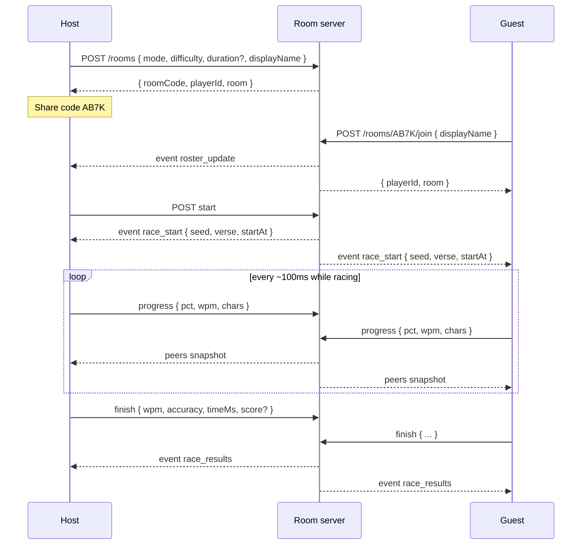
```mermaid
sequenceDiagram
    participant H as Host
    participant S as Room server
    participant G as Guest

    H->>S: POST /rooms { mode, difficulty, duration?, displayName }
    S-->>H: { roomCode, playerId, room }
    Note over H: Share code AB7K

    G->>S: POST /rooms/AB7K/join { displayName }
    S-->>H: event roster_update
    S-->>G: { playerId, room }

    H->>S: POST start
    S-->>H: event race_start { seed, verse, startAt }
    S-->>G: event race_start { seed, verse, startAt }

    loop every ~100ms while racing
        H->>S: progress { pct, wpm, chars }
        G->>S: progress { pct, wpm, chars }
        S-->>H: peers snapshot
        S-->>G: peers snapshot
    end

    H->>S: finish { wpm, accuracy, timeMs, score? }
    G->>S: finish { ... }
    S-->>H: event race_results
    S-->>G: event race_results
```

### 8.7 Fairness rules

| Rule | Detail |
|------|--------|
| Same content | Server picks **one verse** (or Time Trial seed list) and sends it in `race_start`. Clients never choose their own verse mid-race. |
| Same start | `startAt` is a server timestamp; clients wait until `now >= startAt` (with small local countdown). Late joiners **cannot** enter a race already started. |
| Progress truth | Client reports progress; server **clamps** pct to 0–100 and ignores decreases except reconnect recovery. |
| Finish authority | First valid `finish` from each player; server ranks by **finish time** (Classic) or **score then time** (Time Trial). |
| Disconnect | Mark player `disconnected`; after 15s without heartbeat remove from active ranking or place last. |
| Cheat note | v1 is **honor-system casual** (friends). No anti-cheat beyond rate limits. Document that this is not a tournament platform. |

### 8.8 Race modes supported in Live Room

| Solo mode | Live support v1 | How it maps |
|-----------|-----------------|-------------|
| **Classic** | **Yes** | Shared verse; progress = `typedIndex / length`; rank by finish time, then accuracy |
| **Time Trial** | **Yes** | Shared duration + same verse chain seed; rank by words/score at buzzer |
| Ghost Race | No | Solo-only (racing yourself) |
| Manna Rain | **No v1** | Physics + many events; defer to v2 if demand exists |

### 8.9 Client UI

```
┌─────────────────────────────────────────────┐
│  Live Race                    [Leave room]  │
│─────────────────────────────────────────────│
│  Room  AB7K   [Copy]  [Copy invite link]    │
│                                             │
│  Roster                                     │
│  ★ You (Host)     Ready  ●                  │
│    Sarah          Ready  ●                  │
│    Micah          …                         │
│                                             │
│  Mode: Classic ▼   Diff: Medium ▼           │
│  [ Start race ]  (host, when ≥2 ready)      │
└─────────────────────────────────────────────┘

During race:
┌─────────────────────────────────────────────┐
│  You ████████░░ 72%  64 WPM                 │
│  Sarah ██████░░░░ 58%                       │
│  Micah ████░░░░░░ 41%                       │
│─────────────────────────────────────────────│
│  [ existing parchment + typing input ]      │
└─────────────────────────────────────────────┘
```

Entry points in main app:

1. Mode panel button: **🏁 Live Race** (opens lobby flow; not a solo typing mode).
2. Deep link: `https://…/?room=AB7K` → prompt display name → auto-join if room open.

### 8.10 Server data model (ephemeral)

```js
// Room (in-memory / Durable Object)
{
  code: "AB7K",
  hostId: "p_…",
  status: "lobby" | "countdown" | "racing" | "results",
  mode: "classic" | "timeTrial",
  difficulty: "EASY" | "MEDIUM" | "HARD",
  durationSec: 60,          // timeTrial only
  seed: "uuid-or-int",      // deterministic verse selection
  versePayload: { text, reference, translation } | null,
  createdAt: 0,
  expiresAt: 0,
  players: {
    "p_1": {
      id: "p_1",
      name: "Sarah",
      ready: true,
      connected: true,
      progress: 0,          // 0..1
      wpm: 0,
      finished: false,
      result: null          // { timeMs, wpm, accuracy, score? }
    }
  }
}
```

**No long-term user table.** Optional: write finished race summary to client `tr_history` with `mode: "liveRace"` for personal stats only.

### 8.11 API surface (minimal)

| Method | Path | Purpose |
|--------|------|---------|
| `POST` | `/rooms` | Create room; returns `code` + `playerId` |
| `POST` | `/rooms/:code/join` | Join lobby |
| `POST` | `/rooms/:code/leave` | Leave |
| `POST` | `/rooms/:code/ready` | Toggle ready |
| `POST` | `/rooms/:code/start` | Host starts (validates roster) |
| `POST` | `/rooms/:code/progress` | Throttled progress update |
| `POST` | `/rooms/:code/finish` | Submit final stats |
| `WS` / SSE | `/rooms/:code/ws` | Push roster / race_start / peers / results |

Rate-limit progress to **≤10 messages/sec/player**.

### 8.12 Client module shape

```
src/
  multiplayer/
    raceClient.js      # HTTP + WS wrapper
    roomLobby.js       # lobby UI logic
    liveRaceMode.js    # wires Classic/TimeTrial engines to room events
    nameFilter.js      # basic profanity / length filter for display names
```

`liveRaceMode` **does not reimplement typing**. It:

1. Receives `versePayload` from server  
2. Calls existing `loadVerse` / Time Trial start  
3. On each local progress tick, sends `{ pct, wpm }`  
4. Renders peer bars from server snapshots  
5. On local complete, sends `finish` and waits for `race_results`

### 8.13 Privacy & safety (no accounts)

| Concern | Mitigation |
|---------|------------|
| Offensive names | Client + server length limit; basic blocklist; host can **kick** (v1.1 nice-to-have; v1: leave and recreate) |
| Spam rooms | Rate-limit create per IP; room TTL |
| Harassment | No DMs; no free-text chat in v1 (avoids moderation surface) |
| Data retention | Purge room state on expire; no PII collected |
| Kids / church groups | No login friction; codes shared out-of-band (WhatsApp, Discord, verbally) |

**v1 explicitly has no in-room chat** — codes are shared outside the app.

### 8.14 Offline / failure behavior

| Case | Behavior |
|------|----------|
| Server unreachable | Live Race button shows “Contests unavailable”; solo modes unaffected |
| Mid-race disconnect | Reconnect with same `playerId` in `sessionStorage` within 15s; else DNF |
| Host leaves in lobby | Transfer host to longest-waiting player, or dissolve if alone |
| Host leaves mid-race | Race continues; results still computed for remaining finishers |

### 8.15 Acceptance criteria — Live Room Race

- [x] Host creates room and gets a code without signing up
- [x] Guest joins with code + display name only
- [x] Deep link `?room=CODE` joins lobby
- [x] Min players configurable (`MIN_PLAYERS`, default 1 for local; set `2` for contests)
- [x] All players receive identical verse payload (server-picked)
- [x] Countdown from shared `startAt` (3s)
- [x] Peer progress bars via SSE `peers` (~10 Hz client throttle)
- [x] Finishing shows shared ranked results for all clients
- [x] Room TTL purge (45m idle / 10m post-race)
- [x] Solo modes work fully when race server is down
- [x] No account/email/password UI exists anywhere

**Local run**
```bash
# terminal 1
npm run race-server
# terminal 2
npm run dev
# browser: 🏁 Live Race → Create Room → share code
# optional: MIN_PLAYERS=2 npm run race-server
```

### 8.16 Effort estimate

| Workstream | Est. |
|------------|------|
| Backend room service + WS | 10–14h |
| Lobby UI + deep links | 4–6h |
| Wire Classic live race | 4–6h |
| Wire Time Trial live race | 3–5h |
| Peer bars + results podium | 3–4h |
| Deploy, env, failure modes, QA | 4–6h |
| **Total** | **~28–41h** after solo modes exist |

### 8.17 Out of scope (explicit)

- User accounts, OAuth, profiles, friends lists  
- Ranked ELO / global live ladder  
- In-room text/voice chat  
- Manna Rain or Ghost as live contests (v1)  
- Cash prizes / formal tournaments  
- Replay anti-cheat / input video verification  

---

## 9. Cross-Cutting Systems

### 9.1 Leaderboard evolution

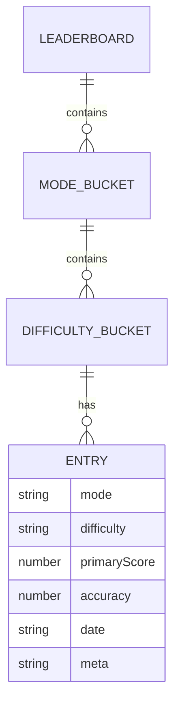
```mermaid
erDiagram
    LEADERBOARD ||--o{ MODE_BUCKET : contains
    MODE_BUCKET ||--o{ DIFFICULTY_BUCKET : contains
    DIFFICULTY_BUCKET ||--o{ ENTRY : has

    ENTRY {
      string mode
      string difficulty
      number primaryScore
      number accuracy
      string date
      string meta
    }
```

**Storage shape (v2):**

```js
// tr_leaderboard
{
  classic:   { EASY: [...], MEDIUM: [...], HARD: [...] },
  timeTrial: { EASY: [...], MEDIUM: [...], HARD: [...] },
  ghost:     { EASY: [...], MEDIUM: [...], HARD: [...] },
  mannaRain: { EASY: [...], MEDIUM: [...], HARD: [...] },
  liveRace:  { EASY: [...], MEDIUM: [...], HARD: [...] }  // local bests only; no server ladder
}
```

**Migration:** On load, if old flat `{ EASY, MEDIUM, HARD }` detected, wrap under `classic` and save. Non-breaking for existing users.

### 9.2 History evolution

```js
{
  mode: "mannaRain", // or classic | timeTrial | ghost | liveRace
  difficulty: "HARD",
  // classic/ghost/liveRace classic
  wpm: 72,
  // timeTrial / mannaRain
  score: 420,
  accuracy: 94,
  ref: "Psalm 23:1-3",
  ts: 1710000000000,
  extra: { combo: 12, livesLeft: 1, duration: 60, place: 2, roomCode: "AB7K" }
}
```

Progress chart: filter by mode dropdown (default: all or last-played mode).  
Live Race history is **local only** (personal place/WPM); server does not keep a permanent ladder.

### 9.3 Completion modal adapter

Single modal shell; content injected by mode:

| Mode | Title | Stat boxes |
|------|-------|------------|
| Classic | Scripture Completed | WPM · Acc · Time |
| Time Trial | Time’s Up | Score · Acc · Verses |
| Ghost | Shadow Defeated / Prevails | WPM · Time · Δ vs Ghost |
| Manna Rain | Word Gathered / Rocky Ground | Score · Combo · Lives |
| Live Race | Race Results | Place · WPM/Score · Acc · field of peers |

Blessing card + Share + Try Again + New Verse remain for solo modes.  
Live Race: **Rematch** (host) / **Back to lobby** / **Leave room** instead of New Verse.

### 9.4 Accessibility

- Mode selector: `role="radiogroup"` + `aria-checked`.
- Live stats: keep `aria-live="polite"`.
- Manna Rain: announce “Word cleared” / “Life lost” via polite live region (throttled).
- Live Race: announce “Race starting”, “You finished 2nd” via polite live region.
- Respect `prefers-reduced-motion`: Manna Rain falls slower / less shake; Ghost bar no spring animation.

---

## 10. File & Module Structure

### 10.1 Target layout (incremental, not big-bang rewrite)

```
Typeracer/
├── index.html
├── styles.css                 # + mode panels, ghost bars, falling words, race lobby
├── app.js                     # bootstrap, wiring, ModeController
├── plan/
│   └── GAME_MODES_IMPLEMENTATION_PLAN.md
├── server/                    # Phase 6 — Live Room Race only
│   ├── package.json
│   ├── index.js               # Worker / HTTP + WS entry
│   └── room.js                # room state machine
└── src/                       # recommended split
    ├── modes/
    │   ├── classic.js
    │   ├── timeTrial.js
    │   ├── ghostRace.js
    │   └── mannaRain.js
    ├── multiplayer/
    │   ├── raceClient.js
    │   ├── roomLobby.js
    │   ├── liveRaceMode.js
    │   └── nameFilter.js
    ├── services/
    │   ├── verses.js
    │   ├── stats.js
    │   ├── persistence.js
    │   └── audio.js
    └── ui/
        ├── modal.js
        ├── statsBar.js
        └── modeSelect.js
```

**Pragmatic path if split is too heavy early:** keep single `app.js` with section boundaries for solo modes; introduce `src/multiplayer/` + `server/` when Phase 6 starts.

### 10.2 Dependency rules

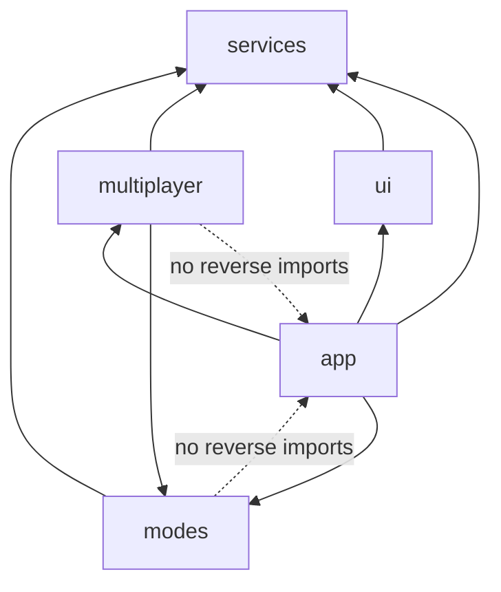
```mermaid
flowchart BT
    modes --> services
    multiplayer --> services
    multiplayer --> modes
    ui --> services
    app --> modes
    app --> multiplayer
    app --> ui
    app --> services
    modes -.->|no reverse imports| app
    multiplayer -.->|no reverse imports| app
```

Modes must not import from `app.js`. Services must not import modes.  
Solo modes must **not** require the race server.

---

## 11. UI / UX Spec

### 11.1 Mode selector placement

```
Header
  controls (sound, theme, LB, progress, translation)
  title
  flourish

Mode panel   ← NEW
  Classic | Time Trial | Ghost Race | Manna Rain | 🏁 Live Race

Difficulty panel (existing seals)
  Easy | Medium | Hard | Custom   + next verse
  (Custom disabled or host-only seed in Live Race lobby)

Mode options strip (contextual)
  Time Trial → duration chips
  Ghost → “Ghost: 78 WPM · John 3:16” or “No shadow yet”
  Manna Rain → “Lives · Fall speed preview”
  Live Race → Create room / Join with code
```

### 11.2 Interaction rules when switching modes

| Situation | Behavior |
|-----------|----------|
| Idle | Switch immediately; load mode default round |
| Mid-run | Confirm dialog: “Leave this race? Progress will be lost.” |
| In Live Race lobby/race | Confirm leave room; notify server |
| Modal open | Close modal, then switch |
| Custom mode + Manna Rain | Allowed — custom text becomes word source |
| Custom + Live Race | **Disabled in v1** — server always seeds verse |

### 11.3 Visual language

Stay inside existing tokens:

- Parchment backgrounds, Cinzel / IM Fell / Lora fonts
- Deep red seals, gold accents, sepia/dark/light themes
- No neon arcade skins — Manna Rain should feel like **sacred rain**, not geometry wars
- Live Race peer bars use seal-red (you) + muted ink (others)

---

## 12. Data Model & Persistence

### 12.1 Keys (client)

| Key | Purpose |
|-----|---------|
| `tr_mode` | Last selected mode |
| `tr_difficulty` | Existing |
| `tr_streak` | Existing (define: global vs per-mode — **recommend per-mode** `tr_streak_{mode}`) |
| `tr_leaderboard` | Migrated nested shape |
| `tr_history` | Entries with `mode` (incl. `liveRace` locally) |
| `tr_ghosts` | Ghost Race PB map |
| `tr_tt_duration` | Last Time Trial duration preference |
| `tr_display_name` | Last Live Race display name (optional convenience) |
| `tr_sound` / `tr_theme` / `tr_translation` | Unchanged |
| `sessionStorage.tr_player_id` | Ephemeral id for reconnect within a room session |

### 12.2 Result object (normalized)

```js
{
  mode: "timeTrial" | "classic" | "ghost" | "mannaRain" | "liveRace",
  difficulty: "EASY" | "MEDIUM" | "HARD" | "CUSTOM",
  primary: number,       // wpm or score
  primaryLabel: "WPM" | "Score",
  accuracy: number,
  durationMs: number,
  ref: string,
  won: boolean,          // ghost / manna / live place===1
  extra: object          // e.g. { place, roomCode, peers: N }
}
```

All solo modes call `Persistence.recordResult(result)` once.  
Live Race may also record a local history row after `race_results`.

### 12.3 Leaderboard note for Live Race

**No server-side global leaderboard in v1.**  
Optional: store best local “live race WPM” under `liveRace` bucket for the personal High Scores panel only.

---

## 13. Phased Delivery Roadmap


```mermaid
gantt
    title Multi-Mode + Live Race Delivery
    dateFormat  X
    axisFormat  %s

    section Phase1
    Mode foundation + migration     :p1, 0, 6
    Classic wrap regression         :p1b, 4, 3

    section Phase2
    Time Trial rules + UI           :p2, 7, 5
    Time Trial LB + tests           :p2b, 11, 2

    section Phase3
    Ghost data + dual bars          :p3, 13, 5
    Ghost win/lose + polish         :p3b, 17, 3

    section Phase4
    Manna playfield + physics       :p4, 20, 6
    Targeting + scoring + polish    :p4b, 25, 6

    section Phase5
    Cross-mode QA + share copy      :p5, 31, 3

    section Phase6
    Race server + room protocol     :p6, 34, 12
    Lobby UI + Classic live wire    :p6b, 44, 8
    Time Trial live + podium + QA   :p6c, 50, 8
```

| Phase | Deliverable | Est. | Exit criteria |
|-------|-------------|------|---------------|
| **0** | Approve this plan | — | Written sign-off |
| **1** | Shared foundation | 6–8h | Mode switch works; Classic unchanged |
| **2** | Time Trial | 4–6h | Playable 60s storm + LB |
| **3** | Ghost Race | 6–8h | Race PB ghost + win/lose |
| **4** | Manna Rain | 12–16h | Full verse rain + lives + score |
| **5** | Polish & QA (solo) | 3–4h | Solo testing checklist green |
| **6** | **Live Room Race** | 28–41h | Create/join/race/results; no accounts; solo still offline-safe |

**Solo total:** ~31–42 hours.  
**With Live Race:** ~59–83 hours focused implementation (not calendar time).

### 13.1 Suggested PR / commit strategy

1. `feat: mode foundation + classic adapter + LB migration`
2. `feat: time trial mode`
3. `feat: ghost race mode`
4. `feat: manna rain mode`
5. `chore: cross-mode polish, a11y, share strings`
6. `feat: live race server + room protocol`
7. `feat: live race lobby + classic multiplayer`
8. `feat: live race time trial + results podium`

Do **not** ship solo modes and multiplayer in one unreviewable dump.

---

## 14. Testing Checklist

### 14.1 Foundation

- [ ] Default mode Classic on fresh localStorage
- [ ] Mode persists after reload
- [ ] Old leaderboard migrates under `classic`
- [ ] Switching mid-run confirms and resets

### 14.2 Time Trial

- [ ] 30/60/90 durations work
- [ ] Verse auto-advances without modal
- [ ] Timer freezes input at 0
- [ ] Score matches manual word count
- [ ] Hard difficulty only serves hard-length content (existing filter)

### 14.3 Ghost Race

- [ ] No ghost → training run saves ghost
- [ ] Ghost bar reaches 100% at PB time (±100ms)
- [ ] Beat ghost updates storage
- [ ] Lose does not overwrite better ghost
- [ ] Difficulty-specific ghosts isolated

### 14.4 Manna Rain

- [ ] Spawn respects max simultaneous
- [ ] Prefix lock prefers lowest word
- [ ] Life loss on ground contact
- [ ] Win on empty queue
- [ ] Lose on 0 lives
- [ ] rAF cancelled on mode exit (no ghost ticks after leave)
- [ ] Custom verse feeds word queue

### 14.5 Live Room Race

- [ ] Create room → code shown; no login wall
- [ ] Second browser joins via code
- [ ] Deep link `?room=CODE` works
- [ ] Start blocked with only 1 player (prod)
- [ ] Both clients show same verse text
- [ ] Progress bars move for remote peer
- [ ] Finish produces same ranking order on both clients
- [ ] Leave room returns to solo app cleanly
- [ ] Kill race server → solo modes still work; Live Race shows unavailable
- [ ] Room code invalid after TTL
- [ ] Display name length / empty name handled

### 14.6 Regression (Classic)

- [ ] Full `TESTING_PLAN.md` Phase 0–3 still passes
- [ ] Share, themes, sound, PWA unchanged

---

## 15. Risks & Mitigations

| Risk | Impact | Mitigation |
|------|--------|------------|
| `app.js` becomes unmaintainable | High | Extract modes early (Phase 1) |
| LB migration corrupts scores | High | Feature-detect old shape; one-way migrate; never delete raw on failure |
| Manna Rain janky on low-end | Medium | DOM cap (max 5 nodes); `transform` only; reduced motion path |
| Unfair multi-word targeting | High | Prefix-lock + lowest-word rule; playtest with repeated prefixes (“the”, “and”) |
| Live Race scope blows up | High | Lock v1 to Classic + Time Trial; no chat; no accounts; ship after solo |
| Backend cost / ops burden | Medium | Ephemeral rooms only; TTL purge; hobby-tier Worker/DO |
| Cheating in casual races | Low–Med | Accept honor system for friends; rate-limit progress; no prizes |
| Race server outage | Medium | Graceful degrade; solo fully independent |
| Mobile keyboard UX for Manna | Medium | Soft warning; slower Easy defaults on coarse pointer |
| Mode bugs break Classic | Critical | Classic regression before every phase merge |

---

## 16. Approval Checklist

Sign off by checking boxes before implementation starts:

### Scope

- [ ] Approve **Time Trial** as specified in §5
- [ ] Approve **Ghost Race** as specified in §6
- [ ] Approve **Manna Rain** as specified in §7
- [ ] Approve **Live Room Race** as specified in §8 (no accounts, room codes)
- [ ] Approve ship order: Foundation → Time Trial → Ghost → Manna → Polish → **Live Race**

### Product defaults

- [ ] Time Trial default duration: **60s**
- [ ] Ghost win condition: **userTime ≤ ghostTime**
- [ ] Manna lives (Medium): **3**
- [ ] Manna match: **case-sensitive**, punctuation stripped
- [ ] Falling mode display name: **Manna Rain**
- [ ] Live Race: **no accounts**, code join, max **8**, modes **Classic + Time Trial**, **no chat**

### Engineering

- [ ] Prefer `src/modes/*` split over mega-`app.js` growth
- [ ] Leaderboard nested migration approach approved
- [ ] Solo modes: no backend required
- [ ] Live Race: lightweight realtime backend approved (Worker/DO or equivalent)

---

## 17. Open Decisions for You

Defaults below are **locked in the plan** unless you override when approving:

1. **Falling mode name:** **Manna Rain**
2. **Ship order:** all solo modes, then Live Race (you may still say “Time Trial only first”)
3. **Ghost scope v1:** **Best run per difficulty**
4. **Time Trial score unit:** **Words cleared**
5. **File split:** **Create `src/` modules** (multiplayer + server especially)
6. **Custom + Manna Rain:** **Allowed**
7. **Live Race backend:** **Cloudflare Workers + Durable Objects** (or swap if you prefer Supabase/PartyKit later)
8. **Live Race v1 modes:** **Classic + Time Trial only**
9. **In-room chat:** **No**

Reply **“approve”** / **“approve with defaults”** or list overrides — then implementation can start at Phase 1.

---

## Appendix A — One-page mode cheat sheet

| | Classic | Time Trial | Ghost Race | Manna Rain | Live Room Race |
|--|---------|------------|------------|------------|----------------|
| Input model | Char stream | Char stream | Char stream | Word buffer | Same as Classic/TT |
| Clock | Count up | Count down | Count up + ghost | Run time | Shared start + mode clock |
| Fail state | Never | Time up | Lose to ghost | 0 lives | Disconnect / DNF |
| Primary score | WPM | Words | WPM + win | Score points | Place + WPM/score |
| New UI | — | Duration chips | Dual bars | Playfield + lives | Lobby + peer bars + podium |
| Network | No | No | No | No | **Yes** (ephemeral rooms) |
| Accounts | No | No | No | No | **No** |
| Reuse engine | 100% | ~90% | ~85% | ~40% | Shell over Classic/TT |
| Effort | — | S | M | L | **XL** |

## Appendix B — Glossary

| Term | Meaning |
|------|---------|
| **Primary score** | The number used to rank the leaderboard for that mode |
| **Ghost** | Saved personal-best pacing opponent (solo) |
| **Prefix lock** | Targeting system that commits to one falling word as you type |
| **Deadline timer** | End time computed once; remaining = deadline − now |
| **Mode controller** | Central switchboard for enter/exit/tick/input |
| **Room code** | Short join key for Live Race (no account) |
| **Host** | Player who created the room; alone may start/rematch |
| **Ephemeral room** | Server state that expires; not a permanent user profile |

## Appendix C — What “done” looks like

When this plan is fully implemented, a player can:

1. Open Scripture Racer and pick a mode from a clear selector.
2. Play **Classic** exactly as today.
3. Survive a **60-second Time Trial** chaining verses for a word score.
4. **Race their shadow** and see a live delta.
5. Play **Manna Rain**, typing falling Scripture words before they hit the ground.
6. **Create or join a Live Room Race** with only a display name + room code — **no account**.
7. Race friends on the same verse (Classic) or same Time Trial seed, see live progress, and get a shared podium.
8. Find mode-separated high scores and history (live results stored locally only).
9. Keep themes, sound, custom verses, and PWA working for all solo modes even if the race server is down.

---

*End of plan. Edit this file or reply with approvals / answers to §17 to begin implementation.*
